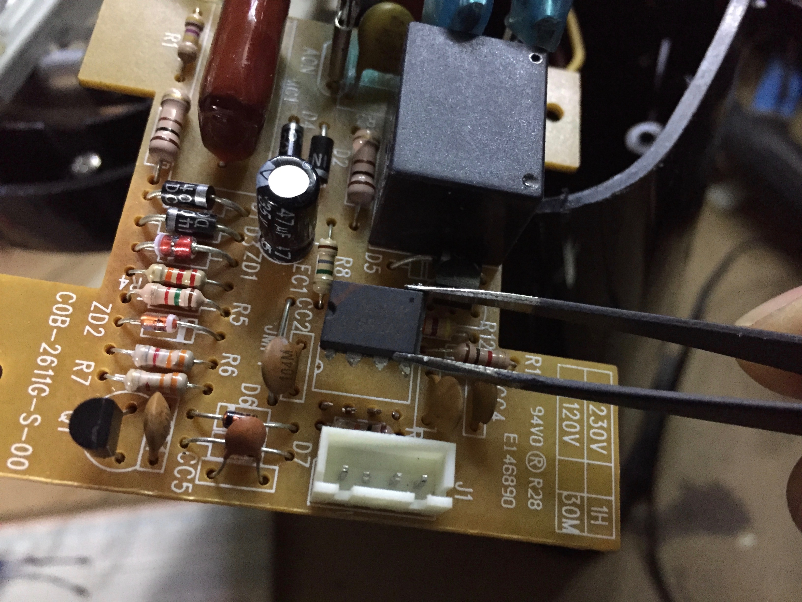
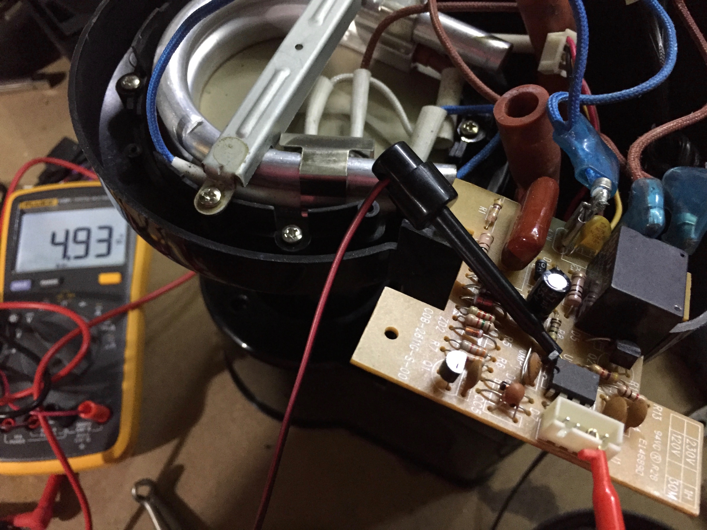
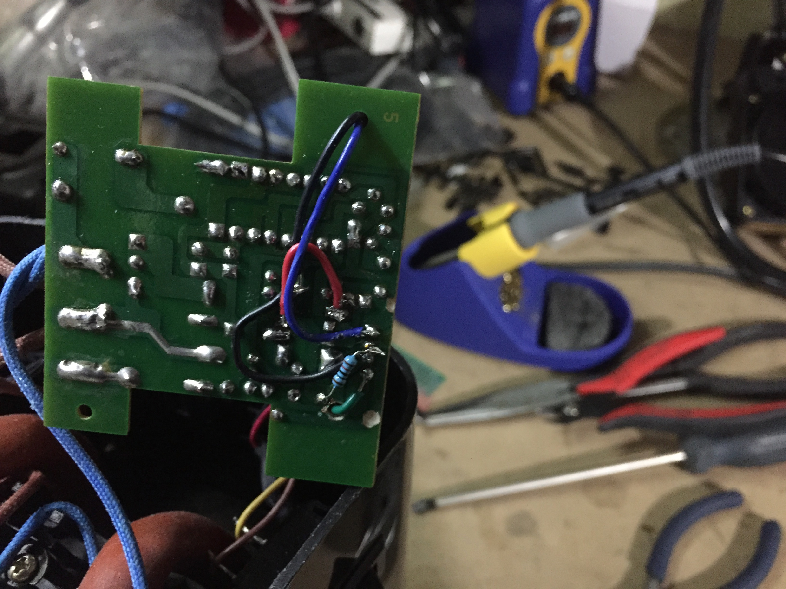

# Cuisinart DCC-450C Coffee Maker Repair

### Description

Cuisinart DCC-450C 53A3P 76B2AC microcontroller failure.  The MCU would only operate the relay when heated to 200C.

Sourcing a new MCU from Aliexpress would cost $20 with a minimum order of two, and then I'd have to figure out how to program it.

Instead, let's use an Arduino Pro Mini.

### Electrical

The power supply feeds 3.5-5VDC to the old microcontroller, so we'll use a 3.3V Arduino Mini at 8MHz.

A0 controls the relay.  A wire is soldered to the resistor connected to the transistor which controls the relay to the heating element.

A1 controls the LED.  The existing circuitry is bypassed and the LED is wired via 1k resistor to A1.

GPIO 2 is used to intercept the button switching on and off.

Traces are cut and wires are bodged into place.

The Arduino's voltage regulator and LED are removed so it can have a low quiesscent current while sleeping.

### Code

At boot up, the sketch will immediately put the Arduino to sleep.

When GPIO 2 goes high, the sketch will turn on the LED and begin the brewing duty cycle.

The relay's duty cycle is ON=45s and OFF=30s for 10 minutes.  The original MCU would stay on for 30 minutes.  This is a bit too much for my hack job.

After 10 minutes elapses, the sketch will transition the Arduino into a low power state.
